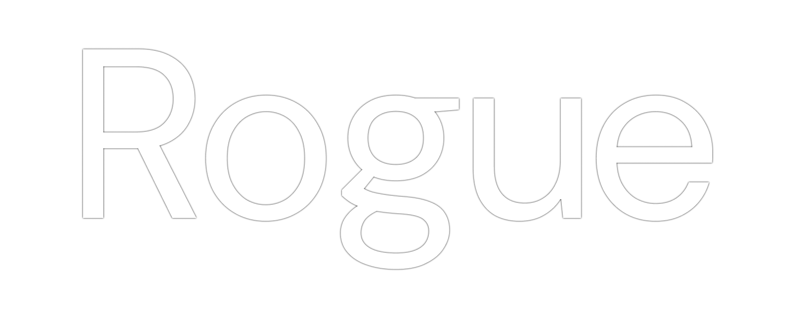

**Minimalist, Opinionated Blogging**

Rogue is a self-hostable blogging platform that provides the essentials — no AI integrations,
no useless features, and no bullsh!&. It allows the creation of articles through [MDX](https://mdxjs.com/) files, 
an extension of markdown, and the creation of custom components with custom styling.

> [!CAUTION]
> Rogue is alpha software, expect breaking changes and bugs.

## Building

TBW

## Installation

TBW

## Configuration

TBW